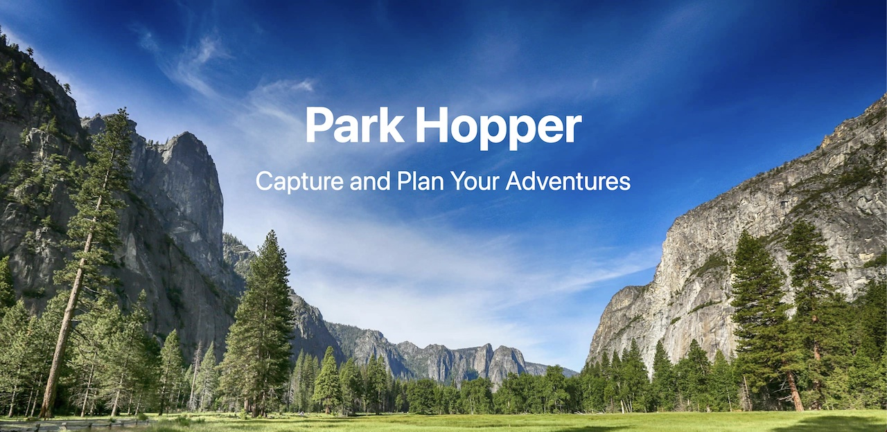

 

# Park Hopper

## Intro
Welcome to Park Hopper, an app to capture and plan your national park adventures. Park Hopper is for avid park enthusiasts seeking a platform to document the parks they've explored and the ones they want to visit. Add photos and comments to create lasting memories of the exciting adventures experienced at these breathtaking locations.
 

## Getting Started
- [Visit ParkHopper](https://parkhopper.fly.dev/)
- [Trello planning materials](https://trello.com/b/O3dyjfy0/park-hopper)
- [GitHub repo](https://github.com/eunicey/park-hopper)

- To Run a local instance:
1. Open Docker
2. > docker compose up
3. go to http://localhost:3000/

- To update model:
1. Under Docker in Activity Bar in VS, right click into park-hopper container to attach shell
2. > python3 manage.py makemigrations
3. > python3 manage.py migrate

 

## Attributions
- National park photos by [Mattia Bericchia](https://unsplash.com/@mattiabericchia), [Alex Povolyashko](https://unsplash.com/@alex_povolyashko), [Harold Wainwright](https://unsplash.com/@haroldwainwright), [Joshua Earle](https://unsplash.com/@huper), [Mick Haupt](https://unsplash.com/@rocinante_11), and [Matthias Mullie](https://unsplash.com/@matthiasmullie)
- Activity photos by [Elijah Austin](https://unsplash.com/@elijahjaustin), [Dino Reichmuth](https://unsplash.com/@dinoreichmuth), [Alex Azabache](https://unsplash.com/@alexazabache), and [Cristofer Maximilian](https://unsplash.com/@cristofer)
- SVGs from [svgrepo](https://www.svgrepo.com/)
 

## Technologies
- Django
- Python
- psycopg2
- supabase
- AWS S3
- Boto3
- Green Unicorn
- WhiteNoise
- Docker
- JavaScript / HTML / CSS
 

## Ice Box
- App is mobile friendly
- Users can edit and delete park activities
- App uses National Park Service API to retrieve park photos